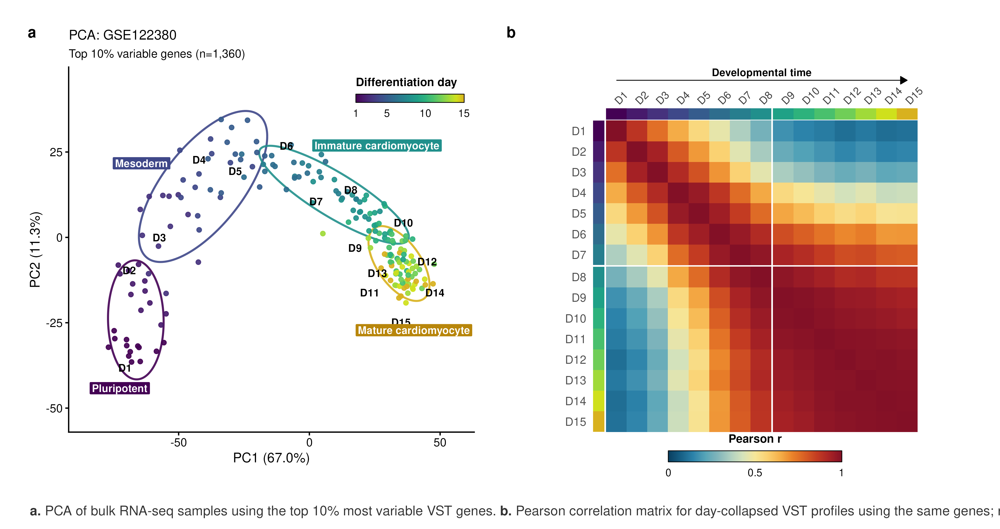
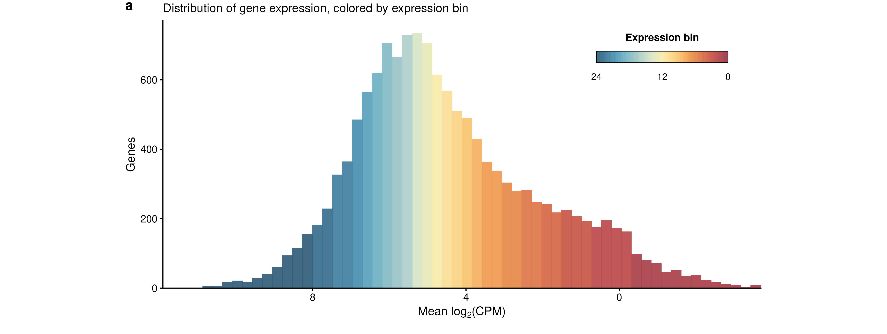
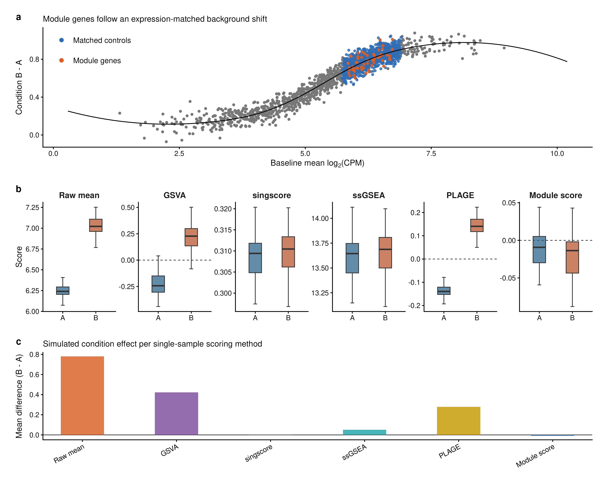
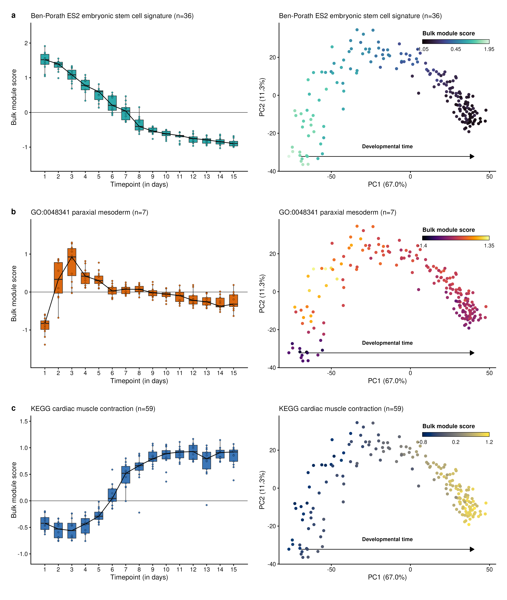
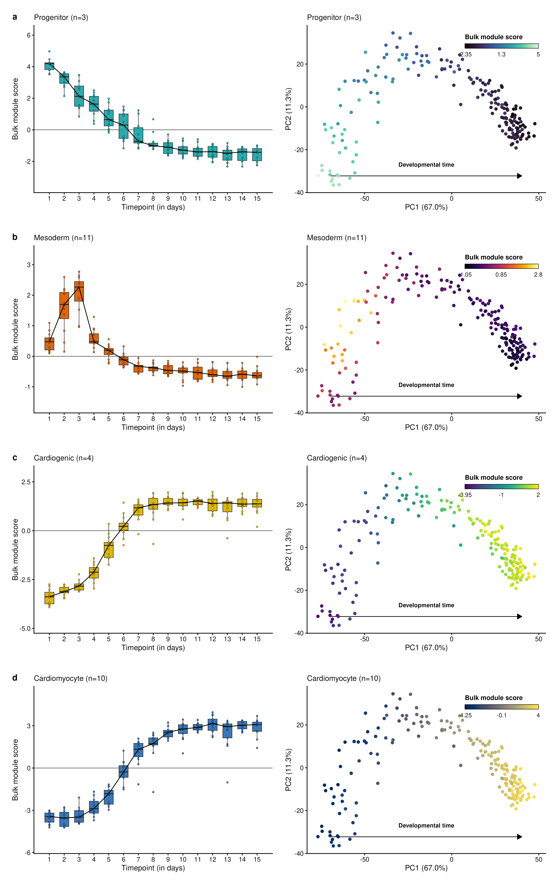
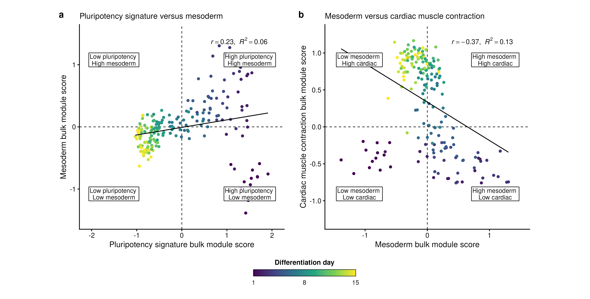
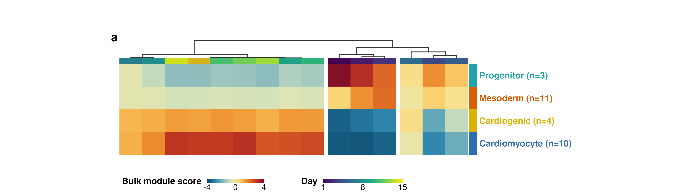
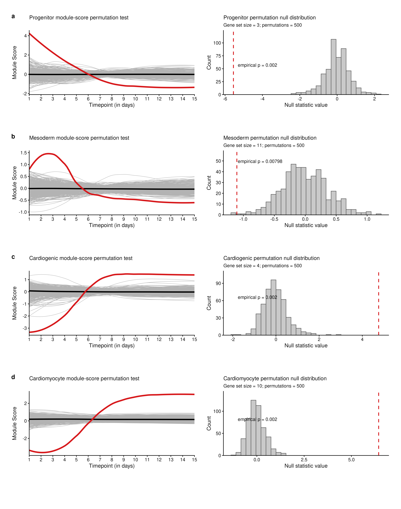

# Expression-matched bulk scoring

## Method basis

R functions for expression-matched gene-set scoring in bulk RNA-seq data,
based on the expression-binned control subtraction used by Seurat's
[`AddModuleScore()` documentation](https://satijalab.org/seurat/reference/addmodulescore)
and
[`AddModuleScore()` source code](https://github.com/satijalab/seurat/blob/HEAD/R/utilities.R).
The same scoring idea traces back to Tirosh et al.'s
[_Science_ melanoma single-cell RNA-seq study](https://pubmed.ncbi.nlm.nih.gov/27124452/),
where expression-matched control genes were used to score gene programs.

This repository is independent of Seurat and the Satija Lab. It is not part of
the official Seurat project, is not maintained by the Seurat authors, and does
not call Seurat internally. The implementation here applies the same control
subtraction principle to normalized bulk RNA-seq matrices, where rows are genes
and columns are samples.

I wrote this for work-related bulk RNA-seq analyses after comparing several
single-sample gene-set scoring approaches. I am sharing it as a small reference
implementation that others can inspect, test, adapt, or improve.

`calc_bulk_module_score()` scores each sample as the mean of the module genes
minus the mean of expression-matched control genes. A score therefore measures
how far a gene set sits above other genes at the same expression level, rather
than the overall expression of the sample.

The repository has three functions:

- `calc_bulk_module_score()` — expression-matched module scores for one or more gene sets
- `perm_bulk_module_score()` — permutation test comparing a gene set against matched or random null sets
- `plot_bulk_module_score_boxplot()` — boxplot of module scores across a sample annotation

## Get the functions

The three files are plain R scripts with no package installation. Download them
into your working directory and `source()` them.

```r
# Update owner/repository/branch if you forked or renamed the repository.
base_url <- "https://raw.githubusercontent.com/ZohebKhan1/expression-matched-bulk-scoring/main/functions"

download.file(paste0(base_url, "/module_score.R"), "module_score.R")
download.file(paste0(base_url, "/permutation.R"), "permutation.R")
download.file(paste0(base_url, "/plot_module_score.R"), "plot_module_score.R")

# Source module_score.R first: permutation.R and plot_module_score.R use
# helpers defined in it.
source("module_score.R")
source("permutation.R")
source("plot_module_score.R")
```

To get the tutorial, data, and report as well, clone the whole repository and
use the bundled loader:

```bash
git clone https://github.com/ZohebKhan1/expression-matched-bulk-scoring.git
cd expression-matched-bulk-scoring
```

```r
source("load_functions.R")  # sources all three files in the correct order
```

## Dependencies

The core scoring functions require **dplyr**, **ggplot2**, and **rlang**.

```r
install.packages(c("dplyr", "ggplot2", "rlang"))
```

The tutorial script uses additional packages, including **GSVA**, **singscore**,
**msigdbr**, **patchwork**, **ggrastr**, **svglite**, and **bookdown**. Install
these only if you run the tutorial.

## Score a gene set

`x` is a normalized expression matrix with genes in rows and samples in columns.
Row names must use the same gene identifiers as the gene sets (symbol, Ensembl,
Entrez, and so on). DESeq2 VST or rlog values are appropriate; the function does
not normalize raw counts.

```r
gene_sets <- list(
  cardiac_muscle_contraction = c("MYH6", "MYH7", "TNNT2", "TNNI3", "ACTN2"),
  paraxial_mesoderm          = c("MEOX1", "TCF15", "TBX6", "MSGN1")
)

# Returns a data frame: samples in rows, one column per module.
score_df <- calc_bulk_module_score(
  x = vst_mat,
  genes_to_score = gene_sets,
  nbin = 24,   # number of average-expression bins
  ctrl = 100,  # control genes sampled per module gene
  seed = 1     # reproducible control sampling; NULL to leave unmanaged
)

head(score_df)
attr(score_df, "gene_set_summary")  # genes requested / present / missing / controls
```

Set `verbose = TRUE` to print an audit and return a list with the score table,
the gene-set summary, and the per-gene control details:

```r
result <- calc_bulk_module_score(vst_mat, gene_sets, verbose = TRUE)
result$scores
result$gene_set_summary
result$details$cardiac_muscle_contraction$pooled_controls
```

A positive score means the module is higher than its expression-matched
background in that sample; a negative score means it is lower.

## Permutation test

`perm_bulk_module_score()` asks whether an observed score pattern is stronger
than expected for random gene sets of the same size. By default the null genes
are drawn from the same average-expression bins as the observed genes, so each
null set has comparable expression structure.

```r
perm <- perm_bulk_module_score(
  x = vst_mat,
  gene_list = gene_sets$cardiac_muscle_contraction,
  metadata = metadata,           # one row per sample
  sample_col = "sample_id",      # column matching colnames(vst_mat)
  group_col = "day",             # scores are summarized within each group
  module_name = "Cardiac muscle contraction",
  n_perm = 1000,
  null_method = "matched_bins",  # or "random" to sample from the full universe
  summary = "median",
  trajectory_stat = "last_minus_first",
  alternative = "greater",
  seed = 1
)

perm$trajectory      # observed statistic, null mean/sd, and empirical p-value
perm$group_p_values  # per-group empirical p-values
perm$histogram       # ggplot of the null distribution with the observed value marked
```

The empirical p-value is `(b + 1) / (n_perm + 1)`, where `b` is the number of
null statistics at least as extreme as the observed statistic. The `+ 1` keeps
the p-value strictly positive.

## Plot scores

`plot_bulk_module_score_boxplot()` returns a standard `ggplot` object, so it can
be themed or combined like any other plot.

```r
p <- plot_bulk_module_score_boxplot(
  score_df = score_df_with_metadata,        # scores joined to sample annotations
  score_col = "cardiac_muscle_contraction",
  x_col = "day",
  fill = "#D95F02",
  x_label = "Timepoint (in days)",
  zero_line = TRUE
)

p
```

## Tutorial results

The tutorial scores public and custom gene sets across the GSE122380
differentiation time course and shows several ways to visualize the results. The
figures below are the panels from the report.

**Dataset structure.** PCA of all samples (colored by differentiation day) and
the sample-to-sample correlation matrix of day-level profiles.



**Expression-bin matching.** Genes are ranked by mean expression and split into
bins; controls for a module gene are drawn from the same bin.



**Why subtract matched controls.** A simulation where high-expression "module"
genes carry no real signal but still shift with a broad Condition B background.
Matched-control subtraction removes most of the apparent effect.



**Public gene-set scores.** Module scores for an embryonic stem-cell signature,
a paraxial mesoderm GO term, and a KEGG cardiac muscle contraction set, shown as
boxplots by day and as matched PCA overlays.



**Custom marker scores.** The same views for progenitor, mesoderm, cardiogenic,
and cardiomyocyte marker sets.



**Score relationships.** Pairwise score plots summarizing transitions between
marker programs across the time course.



**Heatmap.** Replicate-averaged custom marker scores across differentiation day,
clustered by profile similarity.



**Permutation test.** Observed trajectories compared with matched-bin null gene
sets, with the empirical null distribution for each marker set.



## Reproduce the tutorial

Run the workflow from the repository root. It scores the gene sets, runs the
permutation tests, writes tables to `results/`, and regenerates the figures.

```bash
Rscript scripts/01_run_GSE122380_module_score_tutorial.R
```

Re-render the report after editing `report/tutorial.Rmd`:

```bash
Rscript -e 'bookdown::render_book("report")'
```

## Repository layout

```text
functions/            three scoring/plotting source files
load_functions.R      sources all three functions in the correct order
scripts/              reproducible GSE122380 tutorial workflow
report/               bookdown tutorial source and rendered site
report/assets/figures/ figures shown in the README and report
data/                  GSE122380 metadata and processed expression matrices
results/              module-score and permutation output tables
```

## Citation

If you use or adapt these functions, please cite the Seurat `AddModuleScore()`
implementation and Tirosh et al., which introduced the expression-matched
control-subtraction strategy for single-cell data.

The tutorial uses the GSE122380 iPSC-to-cardiomyocyte differentiation time
course from Strober, Elorbany, Rhodes et al., _Science_ (2019).

## References

1. Satija Lab. [Seurat `AddModuleScore()` reference](https://satijalab.org/seurat/reference/addmodulescore) and [source code](https://github.com/satijalab/seurat/blob/HEAD/R/utilities.R).
2. Tirosh I, Izar B, Prakadan SM, et al. [Dissecting the multicellular ecosystem of metastatic melanoma by single-cell RNA-seq](https://pubmed.ncbi.nlm.nih.gov/27124452/). _Science_. 2016;352(6282):189-196.
3. Satija Lab. [Seurat issue #522: AddModuleScore scores clarification](https://github.com/satijalab/seurat/issues/522).
4. Satija Lab. [Seurat issue #7694: AddModuleScore function and number of bins](https://github.com/satijalab/seurat/issues/7694).
5. Hänzelmann S, Castelo R, Guinney J. [GSVA: gene set variation analysis for microarray and RNA-seq data](https://pubmed.ncbi.nlm.nih.gov/23323831/). _BMC Bioinformatics_. 2013;14:7.
6. Love MI, Huber W, Anders S. [Moderated estimation of fold change and dispersion for RNA-seq data with DESeq2](https://genomebiology.biomedcentral.com/articles/10.1186/s13059-014-0550-8). _Genome Biology_. 2014;15:550.
7. Satija Lab. [Seurat cell-cycle scoring vignette](https://satijalab.org/seurat/articles/cell_cycle_vignette).
8. Hao Y, Stuart T, Kowalski MH, et al. [Dictionary learning for integrative, multimodal and scalable single-cell analysis](https://doi.org/10.1038/s41587-023-01767-y). _Nature Biotechnology_. 2023.
9. Ashburner M, Ball CA, Blake JA, et al. [Gene ontology: tool for the unification of biology](https://pubmed.ncbi.nlm.nih.gov/10802651/). _Nature Genetics_. 2000;25(1):25-29.
10. Liberzon A, Birger C, Thorvaldsdottir H, Ghandi M, Mesirov JP, Tamayo P. [The Molecular Signatures Database hallmark gene set collection](https://pubmed.ncbi.nlm.nih.gov/26771021/). _Cell Systems_. 2015;1(6):417-425.
11. Strober BJ, Elorbany R, Rhodes K, et al. [Dynamic genetic regulation of gene expression during cellular differentiation](https://www.science.org/doi/10.1126/science.aaw0040). _Science_. 2019;364(6447):1287-1290. Dataset: [GSE122380](https://www.ncbi.nlm.nih.gov/geo/query/acc.cgi?acc=GSE122380).

## License

MIT License. See [LICENSE.md](LICENSE.md).
