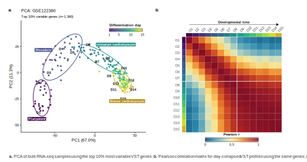
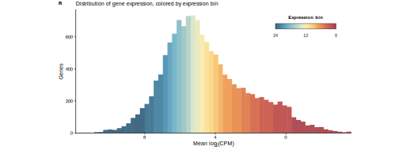
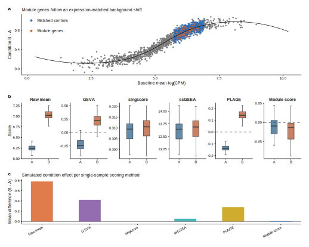
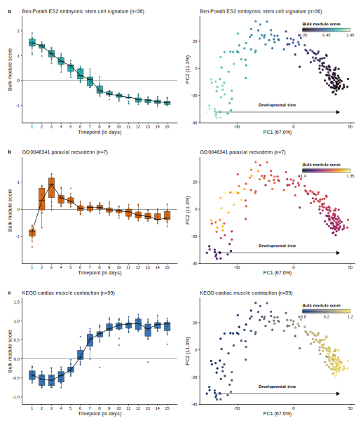
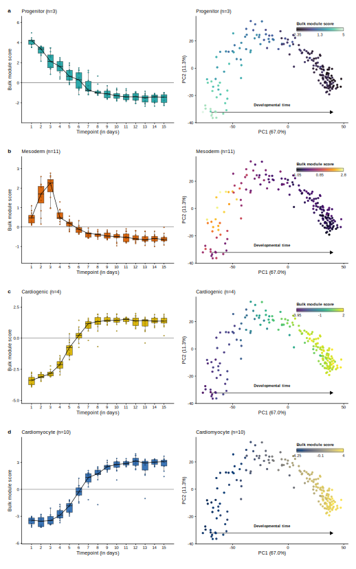
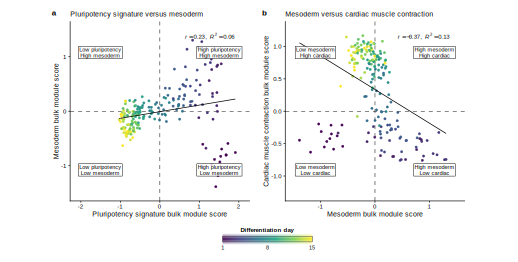

<div class="tutorial-title-block">
<h1 class="title">Expression-matched bulk scoring</h1>
<div class="tutorial-subtitle">Single-sample control-matched gene set scoring for bulk RNA-seq</div>

<div class="tutorial-meta-block">
<div><span>Authors:</span> Zoheb Khan [aut, cre]</div>
<div><span>Version:</span> 0.0.0.9000</div>
<div><span>Modified:</span> 2026-06-02</div>
<div><span>Compiled:</span> 2026-06-26</div>
<div><span>Environment:</span> R version 4.6.0 (2026-04-24)</div>
<div><span>Bioconductor:</span> 3.23</div>
<div><span>Dependencies:</span> DESeq2 {1.52.0}; dplyr {1.2.1}; ggplot2 {4.0.3}; ggtext {0.1.2}; GSVA {2.6.2}; magrittr {2.0.5}; msigdbr {26.1.0}; patchwork {1.3.2}; readr {2.2.0}; scales {1.4.0}; Seurat {5.5.0}; singscore {1.32.0}; svglite {2.2.2}; tibble {3.3.1}; tidyr {1.3.2}; viridisLite {0.4.3}; rlang {1.1.0}</div>
<div><span>Source:</span> <a href="https://github.com/ZohebKhan1/expression-matched-bulk-scoring">https://github.com/ZohebKhan1/expression-matched-bulk-scoring</a></div>
</div>
</div>

# Introduction

This tutorial shows how to calculate expression-matched gene-set scores for bulk RNA-seq samples.

The worked example uses a processed, D0-free GSE122380 iPSC-to-cardiomyocyte differentiation time course. The input expression matrix is already normalized and transformed with a DESeq2-style variance-stabilizing workflow.<sup><a href="#ref-deseq2">6</a></sup> `calc_bulk_module_score()` does not normalize raw counts.

The tutorial has three goals:

1. define the expression-matched bulk scoring calculation
2. show how to score public and custom gene sets
3. visualize score patterns across differentiation day and PCA space

The public gene-set example scores three modules: an embryonic stem-cell signature, a Gene Ontology paraxial mesoderm term, and a KEGG cardiac muscle contraction gene set:

- embryonic stem cell signature, Ben-Porath ES2
- paraxial mesoderm, GO:0048341
- cardiac muscle contraction, KEGG

The custom example scores four marker sets: progenitor, mesoderm, cardiogenic, and cardiomyocyte.

## Citation and reuse

This workflow is not part of the official Seurat project and is not maintained by the Seurat authors. It is an independent bulk RNA-seq workflow that adapts the expression-matched control-subtraction idea behind Seurat's `AddModuleScore()`<sup><a href="#ref-seurat-addmodulescore">1</a></sup> to a normalized genes-by-samples matrix.

I wrote this after comparing several single-sample scoring methods for bulk RNA-seq. The approach turned out to be useful in my own analyses, so I am making the code available for others who want to test or adapt the same idea.

The original Seurat `AddModuleScore()` function was developed for single-cell data. This repository applies the same general scoring principle to bulk RNA-seq samples, where rows are genes and columns are samples. The code here does not call Seurat internally, but does follow their general scoring methodology with some changes to account for the differences in bulk RNA-seq data.

You are welcome to copy, modify, and adapt the code for your own data. If you use or adapt this bulk RNA-seq version of `AddModuleScore()`, please cite the original Seurat package<sup><a href="#ref-seurat-paper">8</a></sup> and Tirosh et al.,<sup><a href="#ref-tirosh">2</a></sup> because the scoring strategy used here is derived from their work.

# GSE122380 bulk RNA-seq time-course dataset

The example uses <a href="https://www.ncbi.nlm.nih.gov/geo/query/acc.cgi?acc=GSE122380">GSE122380</a>, an iPSC-derived cardiomyocyte differentiation bulk RNA-seq time course generated by <a href="https://www.science.org/doi/10.1126/science.aaw0040">Strober, Elorbany, Rhodes et al.</a> The dataset was reprocessed and quality-controlled for this tutorial. In total, this dataset contains 192 bulk RNA-seq samples profiled across 15 days of cardiomyocyte differentiation. The design does not contain replicate libraries from the same cell line and day. Instead, 13 iPSC lines are profiled across differentiation time, which allows score consistency to be assessed across genetic backgrounds.

```{r sample-summary-table, echo=FALSE}
metadata_for_summary <- read.csv("../data/GSE122380_metadata.csv", stringsAsFactors = FALSE)
sample_summary <- aggregate(
  sample_id ~ day,
  data = metadata_for_summary,
  FUN = length)

cell_line_summary <- aggregate(
  cell_line ~ day,
  data = metadata_for_summary,
  FUN = function(x) length(unique(x)))

data_summary <- merge(sample_summary, cell_line_summary, by = "day")
names(data_summary) <- c("day", "Total samples", "Unique cell lines")
data_summary <- data_summary[order(data_summary$day), ]

summary_table <- rbind(
  Samples = data_summary[["Total samples"]],
  `Cell lines` = data_summary[["Unique cell lines"]])

summary_table <- data.frame(
  Metric = rownames(summary_table),
  summary_table,
  row.names = NULL,
  check.names = FALSE)

names(summary_table)[-1] <- paste0("D", data_summary$day)

knitr::kable(
  summary_table,
  format = "html",
  table.attr = 'class="sample-summary-table"',
  align = c("l", rep("r", ncol(summary_table) - 1)),
  caption = "Sample overview for GSE122380 dataset used in this tutorial.")
```

<a class="figure-ref" href="#fig-reference-pca">Figure 2A</a> and <a class="figure-ref" href="#fig-reference-pca">Figure 2B</a> visually summarize the GSE122380 dataset used in this tutorial. <a class="figure-ref" href="#fig-reference-pca">Figure 2A</a> shows a PCA of all samples across the 15 profiled time points. Samples are colored by differentiation day. PC1 largely tracks developmental progression from early pluripotent stages to later cardiomyocyte stages. Samples form approximate temporal groups corresponding to pluripotency, mesoderm, cardiac progenitor, and cardiomyocyte stages.

<a class="figure-ref" href="#fig-reference-pca">Figure 2B</a> is the sample-to-sample correlation matrix heatmap of samples. Replicates are collapsed to one average across cell lines per differentiation day, then the day-level profiles are ordered from D1 through D15 and compared by Pearson correlation. 

```{r reference-pca-figure, echo=FALSE, results='asis', out.width='96%', fig.align='center'}
cat('<div id="fig-reference-pca" class="figure-anchor"></div>\n')

```

<div class="tutorial-figure-caption"><strong>Figure 2.</strong> Experimental structure of the GSE122380 differentiation time course. <strong>a.</strong> PCA of all samples using the top 10% most variable VST genes, colored by differentiation day. <strong>b.</strong> Pearson correlation matrix of replicate-collapsed day profiles using the same variable-gene set as in 2A; row and column annotations encode differentiation day.</div>

# Background

## Background on expression-matched gene-program scoring

The module-score idea comes from the gene-program scoring approach used by <a href="https://pubmed.ncbi.nlm.nih.gov/27124452/">Tirosh et al. *Science*</a>.<sup><a href="#ref-tirosh">2</a></sup> The Seurat R package integrates this strategy through its function `AddModuleScore()`, which scores gene programs after subtracting expression-matched control genes in single-cell RNA-seq data.<sup><a href="#ref-seurat-addmodulescore">1</a></sup> The implementation can be found at the <a href="https://github.com/satijalab/seurat">Seurat GitHub page</a>, and the <a href="https://github.com/satijalab/seurat/issues/522">package authors have written</a> about `AddModuleScore()` interpretation in their GitHub issue discussions.<sup><a href="#ref-seurat-issue-522">3</a></sup> These sources are the best references for Seurat's implementation details, especially expression binning and matched-control subtraction.<sup><a href="#ref-seurat-issue-7694">4</a></sup>

Seurat also uses module-style scoring in applied workflows such as its <a href="https://satijalab.org/seurat/articles/cell_cycle_vignette">cell-cycle scoring vignette</a>.<sup><a href="#ref-seurat-vignette">7</a></sup>

## Bulk RNA-seq implementation

Seurat's `AddModuleScore()` was designed for scoring gene sets in single-cell gene expression matrices. This implementation applies the same expression-matched control-subtraction principle to bulk RNA-seq matrices. The bulk setting differs from single-cell scoring because each column represents a sample-level expression profile rather than a cell. Dropout is less central, but gene abundance, mean-variance structure, composition effects, and preprocessing choices still affect gene-set scores.

In brief, `calc_bulk_module_score()` performs the following steps:

1. **Start with normalized bulk expression.** Let \(x_{g,s}\) be the normalized expression value for gene \(g\) in sample \(s\). Let \(G\) be the genes in the expression matrix, \(S\) be the samples, \(F\) be the requested gene set, and \(U\) be the genes eligible to serve as controls. By default, \(U = G\). For bulk RNA-seq, DESeq2 VST values are a standard choice because the transformation stabilizes the mean-variance relationship.<sup><a href="#ref-deseq2">6</a></sup>

2. **Keep requested genes present in the matrix.** The scored module \(M\) is the overlap between the requested gene set and the matrix row names:

\[
M = F \cap G
\]

3. **Match genes by average expression.** For each gene, calculate average expression across all samples:

\[
\bar{x}_{g} =
\frac{1}{|S|}
\sum_{s \in S} x_{g,s},
\qquad g \in G
\]

Genes are then split into `nbin` bins using \(\bar{x}_{g}\). Let \(b(g)\) denote the bin assigned to gene \(g\). This binning is based on average expression across the full sample set, not on expression within one time point or condition.

The histogram below applies this binning logic to the bulk RNA-seq matrix. Genes are first ordered by their mean normalized expression, here using DESeq2's DESeq2::vst() function with blind=FALSE, and split into 24 approximately equal-sized bins. The first and last bins therefore represent the lowest- and highest-average-expression genes in the matrix. The left panel shows each bin as one point at the median expression level, while the right panel zooms into one representative bin to show that genes inside the same bin have similar average expression and are therefore reasonable expression-matched candidates for control sampling.

A common step for bulk RNA-seq data preprocessing generally involves some type of pre-filtering for lowly-expressed genes (eg, CPM>1 in at least 3 samples). Because the inclusion of lowly-expressed genes clearly influences the number of genes and therefore the average expression per bin, pre-filtering lowly expressed genes is recommended before scoring. Pre-filtering also affects the scored module itself. If requested module genes are retained despite negligible expression, the module mean can be influenced by noisy low-abundance measurements rather than reproducible expression signal.

```{r expression-bin-visualization, echo=FALSE, out.width='100%', fig.align='center'}

```

<div class="tutorial-figure-caption"><strong>Figure 3.</strong> Expression-bin matching for the bulk RNA-seq matrix. The full expression distribution is shown as histogram bars colored by expression bin.</div>

4. **Sample expression-matched controls gene-by-gene.** For each scored gene \(g \in M\), candidate controls are non-module genes from the same expression bin:

\[
A_{g}
=
\{h \in U \setminus M : b(h) = b(g)\}
\]

`calc_bulk_module_score()` samples up to `ctrl` controls from \(A_g\) without replacement, then pools the unique sampled controls across all module genes:

\[
C = \bigcup_{g \in M} C_g
\]

If a scored gene has no eligible same-bin controls because the control universe is restricted, `calc_bulk_module_score()` falls back to the non-module control universe for that gene.

5. **Score each bulk RNA-seq sample.** For each sample, the bulk module score is the module-gene mean minus the pooled-control mean:

\[
\operatorname{BMS}_{s}
=
\frac{1}{|M|}
\sum_{g \in M} x_{g,s}
-
\frac{1}{|C|}
\sum_{h \in C} x_{h,s}
\]

A positive score means the module is higher than its expression-matched background in that sample. A negative score means the module is lower than that background.

The diagram below shows the calculation for one input gene set. Control sampling is performed gene-by-gene, but the final score is calculated once for the whole module in each sample.

```{.mermaid}
%%{init: {"flowchart": {"nodeSpacing": 44, "rankSpacing": 54}}}%%
flowchart TB
  subgraph input[" "]
    direction TB
    X["<b>Expression matrix X</b><br/>Rows are genes G. Columns are samples S."]
    F["<b>Feature set F</b><br/>This is the requested gene list."]
    U["<b>Control universe U</b><br/>By default, this is all genes in G."]
  end

  subgraph matching[" "]
    direction TB
    M["<b>Scored module M</b><br/>Keep genes in F that are present in X."]
    Xmean["<b>Gene-level average expression</b><br/>Average each gene across all samples in S."]
    Bins["<b>Expression bins</b><br/>Assign genes in G to nbin bins by average expression."]
    Controls["<b>Per-gene control sampling</b><br/>For each gene in M, sample up to ctrl non-module genes from the same bin."]
    Pooled["<b>Pooled control set C</b><br/>Combine sampled controls across M and keep unique genes."]
  end

  subgraph scoring[" "]
    direction TB
    ModuleMean["<b>Module mean per sample</b><br/>Average expression across all genes in M."]
    ControlMean["<b>Control mean per sample</b><br/>Average expression across all genes in C."]
    Score["<b>Bulk module score per sample</b><br/>Subtract the control mean from the module mean."]
  end

  subgraph interpretation[" "]
    direction TB
    Interpret["<b>Interpretation</b><br/>Positive scores are above matched background.<br/>Negative scores are below matched background."]
  end

  X --> M
  F --> M
  U --> Controls
  M --> Xmean --> Bins --> Controls --> Pooled
  M --> ModuleMean
  Pooled --> ControlMean
  ModuleMean --> Score
  ControlMean --> Score
  Score --> Interpret

  classDef inputNode fill:#edf4ff,stroke:#4169e1,stroke-width:2px,color:#111111;
  classDef matchNode fill:#eef8f6,stroke:#1b7f79,stroke-width:2px,color:#111111;
  classDef scoreNode fill:#f2ecfb,stroke:#8968cd,stroke-width:2px,color:#111111;
  classDef finalNode fill:#fff4df,stroke:#b36b00,stroke-width:2px,color:#111111;
  class X,F,U inputNode;
  class M,Xmean,Bins,Controls,Pooled matchNode;
  class ModuleMean,ControlMean,Score scoreNode;
  class Interpret finalNode;
  style input fill:#f7fbff,stroke:#4169e1,stroke-width:3.2px,color:#4169e1;
  style matching fill:#f7fcfb,stroke:#1b7f79,stroke-width:3.2px,color:#1b7f79;
  style scoring fill:#fbf8ff,stroke:#8968cd,stroke-width:3.2px,color:#8968cd;
  style interpretation fill:#fff9e8,stroke:#b36b00,stroke-width:2.4px,color:#b36b00;
```

## Why subtract matched controls?

Averaging the module genes is the simplest score, but the average mostly reflects how highly those genes are expressed. Gene sets are often dominated by abundant, stably expressed genes, so their mean follows the overall expression level of each sample. When the expression background shifts from one sample to the next, the module mean shifts with it, whether or not the program it represents is active.

Matched control subtraction removes that baseline. For each module gene, `calc_bulk_module_score()` takes control genes at the same expression level and subtracts their mean from the module mean. Effects that all genes at that expression level share, such as overall abundance, library size, and composition, cancel out, leaving how far the module sits above other genes of comparable expression. Single-cell data need this correction because of heavy dropout. Bulk RNA-seq has little dropout, but abundance and composition effects do not go away.

The simulation is built to trigger a false positive. Its module genes carry no real signal; they are highly expressed genes pulled from a stretch of the distribution that happens to rise in Condition B. Scored on this data, the raw module mean, GSVA, singscore, ssGSEA, and PLAGE all report a Condition B increase.<sup><a href="#ref-gsva">5</a></sup> Matched subtraction removes most of it. Even then, a positive score is not proof that a pathway is active; it only tells you the set is higher than expression-matched genes in that sample.

```{r module-score-simulation, echo=FALSE, out.width='100%', fig.align='center'}

```

<div class="tutorial-figure-caption"><strong>Figure 4.</strong> Simulation illustrating why matched-control subtraction can matter. <strong>a.</strong> The simulated module genes occupy the same expression range as their matched controls and share a broad Condition B background shift. <strong>b.</strong> Raw module mean, GSVA, singscore, ssGSEA, PLAGE, and module scores are computed from the same simulated log<sub>2</sub>(CPM)-scale matrix. <strong>c.</strong> The estimated Condition B minus Condition A effect is attenuated after subtracting expression-matched controls. PLAGE scores are sign-oriented to the raw module mean because the SVD sign is arbitrary.</div>

# Setup for bulk module gene set scoring

The scoring functions live in `functions/` and are loaded with
`source("load_functions.R")` from the repository root.

```{r setup-analysis, include=FALSE}
knitr::opts_chunk$set(
  echo = FALSE,
  message = FALSE,
  warning = FALSE,
  fig.align = "center"
)
```

`calc_bulk_module_score()` needs two core inputs:

- an expression matrix
- one or more gene sets

```{.mermaid}
%%{init: {"flowchart": {"nodeSpacing": 22, "rankSpacing": 24}, "themeVariables": {"fontSize": "15px"}}}%%
flowchart LR
  X["<b>normalized gene matrix</b><br/>genes x samples"]
  F["<b>genes_to_score</b><br/>gene set(s)"]
  O["<b>options</b><br/>universe, nbin, ctrl,<br/>seed, min_genes"]
  S["<b>calc_bulk_module_score()</b>"]
  R["<b>scores</b><br/>samples x modules"]

  X --> S
  F --> S
  O --> S
  S --> R

  classDef input fill:#edf4ff,stroke:#4169e1,stroke-width:1.5px,color:#111111;
  classDef option fill:#f8fafc,stroke:#64748b,stroke-width:1.3px,color:#111111;
  classDef function fill:#eef8f6,stroke:#1b7f79,stroke-width:1.6px,color:#111111;
  classDef output fill:#fff4df,stroke:#b36b00,stroke-width:1.6px,color:#111111;
  class X,F input;
  class O option;
  class S function;
  class R output;
```

The expression matrix should be numeric, with genes in rows and samples in columns. Row names should be gene identifiers. Column names should be sample IDs. Gene sets must use the same identifier type as the expression matrix row names (ENTREZ, ENSEMBL, gene symbol, etc).

While `calc_bulk_module_score()` will run on any finite numeric matrix, the matrix should be normalized and transformed so samples are comparable and extreme mean-variance effects are reduced. DESeq2 VST or rlog values are appropriate choices for count matrices. Log2-transformed TPM, CPM, or DESeq2-normalized counts can also be used for exploratory scoring, provided the preprocessing is consistent across samples.

For this analysis, the input is a batch-corrected VST matrix.

The main scoring call for `calc_bulk_module_score()` is straightforward. First, pass the expression matrix, a named list of gene sets, and choose the control-sampling settings. The function validates that the expression matrix is numeric, that gene and sample names are unique, and that enough requested module genes are present to score each module. For each module, it returns one score per sample.

The full call, with every argument shown at its default, is:

```{r scoring-call-layout, eval=FALSE, echo=TRUE}
score_df <- calc_bulk_module_score(
  x = vst_mat,                 # normalized genes-by-samples matrix
  genes_to_score = gene_sets,  # one character vector, or a named list of them
  universe = NULL,             # control pool; NULL uses every gene in x
  nbin = 24,                   # number of average-expression bins
  ctrl = 100,                  # controls sampled per module gene
  seed = 1,                    # random seed; NULL leaves the state unmanaged
  min_genes = 1,               # module genes that must be present in x to score
  warn_missing = TRUE,         # warn when requested genes are absent from x
  verbose = FALSE              # TRUE also returns a per-module audit summary
)
```

Key arguments are explained below:

**Required inputs**

- `x`: numeric normalized expression matrix with gene row names and sample column names.
- `genes_to_score`: one gene set as a character vector, or multiple gene sets as a named list of character vectors if you are scoring multiple gene sets at once.

**Control matching**

- `universe`: optional set of genes eligible to be sampled as controls; defaults to all genes in `x`. Pre-filtering for lowly-expressed genes would therefore restrict your universe to a smaller subset of more robustly expressed genes.
- `nbin`: number of average-expression bins used for expression matching. The default is 24, the same as Seurat's AddModuleScore(). With n=16,000 total expressed genes, this means that each bin will contain approximately 667 genes, which I think is a biologically reasonable number of genes to capture in a single bin. Of course, this number is arbitrary and you can change it to suit your needs.
- `ctrl`: maximum number of control genes sampled per module gene. Here, the default is 100 control genes per module gene. This means that for every gene that is in the scoring gene list, 100 control genes will be sampled from the same average-expression bin and used as the control set to subtract from the module mean.
- `seed`: random seed for reproducible control sampling; use `NULL` to leave the random state unmanaged.

**Validation and audit output**

- `min_genes`: minimum number of module genes that must be present in `x` for a module to be scored.
- `warn_missing`: whether to warn when genes present in the supplied scoring gene set are absent from the expression matrix `x`.
- `verbose`: when `TRUE`, print a compact audit summary and return gene/control details in addition to the score table.

# GO and MSigDB module scores for GSE122380

This example scores public gene sets from <a href="https://geneontology.org/">Gene Ontology</a> and <a href="https://www.gsea-msigdb.org/gsea/msigdb/">MSigDB</a> in the GSE122380 time course.<sup><a href="#ref-go">9</a></sup><sup><a href="#ref-msigdb">10</a></sup> Other useful sources of gene sets include <a href="https://reactome.org/">Reactome</a> and <a href="https://www.genome.jp/kegg/">KEGG</a>. For a tutorial workflow, the main requirement is that the gene identifiers in the gene set match the row names of the expression matrix.

In the figures below, each row shows two visualization methods for bulk module scores: on the left, a boxplot of module scores across differentiation day; on the right, a PCA plot of all samples colored by bulk module score. For each sample, `calc_bulk_module_score()` returns the mean expression of the module genes minus the mean expression of pooled expression-matched control genes. The dashed horizontal line at y = 0 marks zero, where those two means are equal in that sample. The PCA view is similar visually to coloring a single-cell embedding by module score, but here the points are bulk RNA-seq samples and not cells.

The embryonic stem-cell scores (top) are highest early (D1) and decline as differentiation progresses. The mesoderm scores increase after the pluripotency window (D2-D3), and subsequently fall as cells commit to the cardiomyocyte fate. The cardiac muscle contraction module begins to increase around D6, consistent with activation of cardiomyocyte structural and contractile programs during later differentiation.

```{r public-scoring-code, eval=FALSE, echo=TRUE}
# Retrieve the public gene sets used in the example.
get_msigdb_gene_set <- function(gene_set_name, collection, subcollection = NULL) {
  msigdbr::msigdbr(
    db_species = "HS",
    species = "Homo sapiens",
    collection = collection,
    subcollection = subcollection
  ) %>%
    dplyr::filter(
      .data$gs_name == gene_set_name,
      !is.na(.data$gene_symbol)
    ) %>%
    dplyr::distinct(.data$gene_symbol) %>%
    dplyr::pull(.data$gene_symbol) %>%
    intersect(rownames(vst_mat))
}

public_genes_to_score <- list(
  embryonic_stem_cell_signature = get_msigdb_gene_set(
    "BENPORATH_ES_2",
    collection = "C2",
    subcollection = "CGP"
  ),
  paraxial_mesoderm = get_msigdb_gene_set(
    "GOBP_PARAXIAL_MESODERM_FORMATION",
    collection = "C5",
    subcollection = "GO:BP"
  ),
  kegg_cardiac_muscle_contraction = get_msigdb_gene_set(
    "KEGG_CARDIAC_MUSCLE_CONTRACTION",
    collection = "C2",
    subcollection = "CP:KEGG_LEGACY"
  )
)

public_score_df <- calc_bulk_module_score(
  x = vst_mat,
  genes_to_score = public_genes_to_score
)
```

```{r public-module-figure, echo=FALSE, out.width='100%', fig.align='center'}

```

<div class="tutorial-figure-caption"><strong>Figure 5.</strong> Public gene-set module scores across the GSE122380 differentiation time course. Boxplots show score distributions by day, and matched PCA panels show the same sample-level scores projected onto the reference PCA space.</div>

# Custom marker score visualization

Custom marker sets can also be supplied directly. Very small gene sets should be interpreted carefully; if a set contains only one or two genes, directly plotting the individual gene-expression trends is often more transparent and informative.

An aggregate module score summarizes a marker list without requiring a separate expression plot for every gene. This is useful when the marker set is large enough that individual-gene plots become difficult to interpret. The tradeoff is loss of gene-level detail. It is, by definition, a summary of the gene set, so it may not capture all of the biological nuance of the individual genes in the set. For small or heterogeneous marker sets, inspect the individual gene-expression trends before interpreting the aggregate score.

Below, we define custom marker gene sets for pluripotency, mesoderm, cardiogenic and cardiomyocyte stages.

```{r custom-scoring-code, eval=FALSE, echo=TRUE}
# Define stage marker sets with the same identifier type as rownames(vst_mat).
custom_marker_genes <- list(

  progenitor = c("ESRG", "NANOG", "SOX2", "TDGF1", "POU5F1"),

  mesoderm = c("EOMES", "MESP1", "MESP2", "MIXL1", "TBXT",
               "FOXF1", "MSX1", "MSX2", "TWIST1", "SNAI1", "HAND1"),

  cardiogenic = c("TBX5", "GATA4", "NKX2-5", "MEF2C"),

  cardiomyocyte = c("ACTN2", "MYH6", "MYH7", "MYL7", "PLN",
                    "RYR2", "TNNC1", "TNNI3", "TNNT2", "TTN")
)

# Score all custom marker sets with the same control-matching settings.
custom_score_df <- calc_bulk_module_score(
  x = vst_mat,
  genes_to_score = custom_marker_genes
)
```

The analogous boxplot and PCA visualizations are shown below for the custom marker sets. The custom scores are consistent with the expected differentiation structure: progenitor scores are highest early and decline with differentiation, while cardiomyocyte scores rise later.

```{r custom-marker-figure, echo=FALSE, out.width='100%', fig.align='center'}

```

<div class="tutorial-figure-caption"><strong>Figure 6.</strong> Custom marker-set scores for progenitor, mesoderm, cardiogenic, and cardiomyocyte signatures. Boxplots summarize temporal score changes, and PCA panels show where high-scoring samples fall in the differentiation trajectory.</div>

# Module score correlation scatterplots

Pairwise score plots can show how module programs covary across samples. In a time-course design, these relationships can summarize transitions between marker programs. In the GSE122380 dataset, pluripotency-related scores should decline as cells differentiate into mesoderm, and mesoderm-related scores should rise transiently as cells differentiate into cardiogenic progenitors, and then decline as cells differentiate into cardiomyocytes.

The paired scatterplots below summarize two relationships: pluripotency versus mesoderm, and mesoderm versus cardiac muscle contraction. The observed relationships are consistent with the expected temporal ordering of pluripotency, mesoderm, and cardiomyocyte programs.

```{r public-score-relationship, echo=FALSE, out.width='100%', fig.align='center'}

```

<div class="tutorial-figure-caption"><strong>Figure 7.</strong> Pairwise relationships between public module scores. Each point is one sample colored by differentiation day, with a linear best-fit line and quadrant labels indicating high/low score combinations after axis reversal.</div>

# Alternative module-score visualizations

In addition to the boxplot and PCA visualizations shown above, module scores can also be visualized as a compact heatmap using the ComplexHeatmap package. In the heatmap below, each row represents a custom marker set, while each column represents the replicate-averaged module score for one differentiation time point. Columns are clustered by similarity across the marker-set scores. The clustered heatmap groups adjacent differentiation days with similar marker-score profiles, providing a compact view of temporal changes across modules.

Other visualizations may be preferable for different designs. For example, paired-line plots are useful for matched samples, while coefficient plots are useful when scores are analyzed with a regression model. The plotting code for the boxplots, PCA overlays, and heatmap is included in the repository.

```{r custom-marker-heatmap, echo=FALSE, results='asis'}
heatmap_path <- "assets/figures/custom_marker_score_heatmap.svg"
heatmap_version <- as.integer(file.info(heatmap_path)$mtime)
cat(sprintf(
  '<p></p>',
  heatmap_path,
  heatmap_version
))
```

<div class="tutorial-figure-caption"><strong>Figure 8.</strong> Heatmap view of replicate-averaged custom marker-set scores across differentiation day. Rows are marker sets and columns are day-level profiles, with the top annotation indicating developmental time.</div>

# Custom marker permutation tests

After scoring a module, a natural follow-up is whether its score pattern is stronger than what random gene sets of the same size would produce. `perm_bulk_module_score()` answers this by comparing the observed gene set against many size-matched null sets.

The function first scores the observed gene set with the same expression-matched procedure used by `calc_bulk_module_score()`. It then repeatedly samples null gene sets of equal size, either from matched average-expression bins (the default) or from the full eligible universe, scores each null set the same way, and compares the observed sample-, group-, or trajectory-level statistic against the null distribution. The returned object holds the observed scores, null scores, summary tables, empirical p-values, optional plots, and the parameters used for the test.

As configured in this tutorial, the steps are:

1. Score the observed marker set.
2. Draw a size-matched null set, one gene per observed gene from the same expression bin, and repeat this `n_perm` times.
3. Score each null set with the same module-score procedure.
4. Summarize the observed and null scores within each group, here differentiation day.
5. Calculate the requested trajectory statistic for the observed summary and for every null summary.
6. Estimate the empirical p-value as `(b + 1) / (n_perm + 1)`, where `b` is the number of null statistics at least as extreme as the observed statistic.

```{r permutation-code, eval=FALSE, echo=TRUE}
perm <- perm_bulk_module_score(
  x = vst_mat,
  gene_list = custom_marker_genes$cardiomyocyte,
  metadata = metadata,
  sample_col = "sample_id",
  group_col = "day",
  module_name = "Cardiomyocyte",
  n_perm = 500,
  null_method = "matched_bins",
  random_genome = FALSE,
  summary = "median",
  trajectory_stat = "last_minus_first",
  alternative = "two.sided"
)

perm$trajectory
perm$group_p_values
```

This test fits questions about whether module scores change across time or condition more than expected by chance. Here the null is expression-bin matched, so each random set has average-expression structure similar to the marker set. Each null-distribution panel plots the null trajectory statistics as a histogram, marks the observed value with a dashed line, and annotates the empirical p-value.

For two independent groups, a Wilcoxon rank-sum test can be used as an exploratory comparison of module scores. For paired or repeated-measure designs, use a paired test or a model that accounts for the sample structure. Such p-values should be treated as exploratory unless the test matches the experimental design and the gene set was specified independently of the data.

```{r custom-permutation-figure, echo=FALSE, out.width='100%', fig.align='center'}
knitr::include_graphics("assets/figures/custom_marker_permutation_run.svg")
```

<div class="tutorial-figure-caption"><strong>Figure 9.</strong> Matched-bin permutation test for custom marker-set scores. Observed trajectories are compared with random gene sets of the same size sampled from expression-matched bins, and empirical null distributions summarize the expected trajectory statistic under the matched null.</div>

# References

<ol class="reference-list">
<li id="ref-seurat-addmodulescore"><strong>1.</strong> Satija Lab. <a href="https://satijalab.org/seurat/reference/addmodulescore">Seurat `AddModuleScore()` reference</a> and <a href="https://github.com/satijalab/seurat/blob/HEAD/R/utilities.R">source code</a>.</li>
<li id="ref-tirosh"><strong>2.</strong> Tirosh I, Izar B, Prakadan SM, et al. <a href="https://pubmed.ncbi.nlm.nih.gov/27124452/">Dissecting the multicellular ecosystem of metastatic melanoma by single-cell RNA-seq</a>. <em>Science</em>. 2016;352(6282):189-196.</li>
<li id="ref-seurat-issue-522"><strong>3.</strong> Satija Lab Seurat issue #522. <a href="https://github.com/satijalab/seurat/issues/522">AddModuleScore scores clarification</a>.</li>
<li id="ref-seurat-issue-7694"><strong>4.</strong> Satija Lab Seurat issue #7694. <a href="https://github.com/satijalab/seurat/issues/7694">AddModuleScore function and Number of bins</a>.</li>
<li id="ref-gsva"><strong>5.</strong> Hänzelmann S, Castelo R, Guinney J. <a href="https://pubmed.ncbi.nlm.nih.gov/23323831/">GSVA: gene set variation analysis for microarray and RNA-seq data</a>. <em>BMC Bioinformatics</em>. 2013;14:7. See also the <a href="https://www.bioconductor.org/packages/release/bioc/html/GSVA.html">GSVA Bioconductor package page</a>.</li>
<li id="ref-deseq2"><strong>6.</strong> Love MI, Huber W, Anders S. <a href="https://genomebiology.biomedcentral.com/articles/10.1186/s13059-014-0550-8">Moderated estimation of fold change and dispersion for RNA-seq data with DESeq2</a>. <em>Genome Biology</em>. 2014;15:550. See also the <a href="https://bioconductor.org/packages/release/bioc/html/DESeq2.html">DESeq2 Bioconductor package page</a>.</li>
<li id="ref-seurat-vignette"><strong>7.</strong> Satija Lab. <a href="https://satijalab.org/seurat/articles/cell_cycle_vignette">Seurat cell-cycle scoring vignette</a>, an applied Seurat vignette using module-style scores.</li>
<li id="ref-seurat-paper"><strong>8.</strong> Hao Y, Stuart T, Kowalski MH, et al. <a href="https://doi.org/10.1038/s41587-023-01767-y">Dictionary learning for integrative, multimodal and scalable single-cell analysis</a>. <em>Nature Biotechnology</em>. 2023. See also the <a href="https://satijalab.org/seurat/authors">Seurat package documentation and citation guidance</a> (Seurat v5).</li>
<li id="ref-go"><strong>9.</strong> Ashburner M, Ball CA, Blake JA, et al. <a href="https://pubmed.ncbi.nlm.nih.gov/10802651/">Gene ontology: tool for the unification of biology</a>. <em>Nature Genetics</em>. 2000;25(1):25-29.</li>
<li id="ref-msigdb"><strong>10.</strong> Liberzon A, Birger C, Thorvaldsdottir H, Ghandi M, Mesirov JP, Tamayo P. <a href="https://pubmed.ncbi.nlm.nih.gov/26771021/">The Molecular Signatures Database hallmark gene set collection</a>. <em>Cell Systems</em>. 2015;1(6):417-425.</li>
</ol>

# Session Info

```{r session-info, echo=FALSE}
sessionInfo()
```
